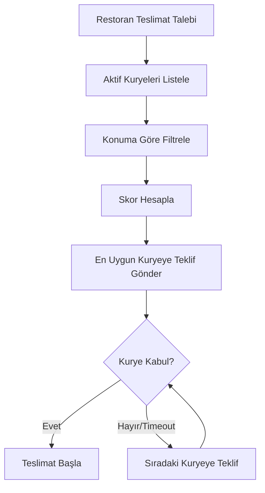

# 📦 Courier Platform MVP - Detaylı Proje Analizi

> **Proje Adı:** courier-platform-mvp  
> **Amaç:** Restoranların anlık kurye ihtiyacını serbest çalışan kuryelerle eşleştiren B2B platform  
> **Mimari:** Monorepo (pnpm workspaces)  
> **Analiz Tarihi:** 21 Ocak 2026

---

## 🎯 Proje Vizyonu ve Kapsamı

### Temel Amaç
Restoranların **anlık kurye bulma problemini** çözen, kuryelere **tam esnek, vardiyasız ve serbest çalışma** imkânı sunan, **gerçek zamanlı ve ölçeklenebilir** bir eşleştirme platformu.

### ⚠️ Önemli Ayrım
Bu proje bir **yemek siparişi uygulaması DEĞİLDİR**:
- ❌ Son müşteri (consumer) yok
- ❌ Mağaza/ürün kataloğu yok
- ❌ Online sipariş sistemi yok
- ✅ Sadece **Restoran ↔ Kurye** eşleştirmesi var

| Aktör | Rol |
|-------|-----|
| **Restoran/Esnaf** | Teslimat için kurye talep eden taraf |
| **Kurye** | Serbest çalışan, istediği zaman aktif olan teslimatçı |
| **Platform** | Akıllı eşleştirme, takip ve puanlama sistemi |

### Kurye Tipleri
| Tip | Araç | Özellik |
|-----|------|---------|
| 🚶 Yaya | - | Kısa mesafe, merkezi bölgeler |
| 🚴 Bisikletli | Bisiklet | Orta mesafe, şehir içi |
| 🚗 Arabalı | Otomobil/Motor | Uzun mesafe, çevre ilçeler |

---

## 🧠 Sipariş Dağıtım Mantığı (Akıllı Eşleştirme)

### Eşleştirme Algoritması

```
Skor = (Mesafe × 0.4) + (Kurye Puanı × 0.3) + (Geçmiş Teslim Başarısı × 0.3)
```

**Eşleştirme Akışı:**


### Skor Bileşenleri

| Bileşen | Ağırlık | Açıklama |
|---------|---------|----------|
| **Mesafe** | %40 | Restorandan kurye konumuna mesafe |
| **Kurye Puanı** | %30 | Restoran tarafından verilen ortalama puan |
| **Geçmiş Başarı** | %30 | Tamamlanan/Toplam teslimat oranı |

---

## 🤖 AI/ML Destekli Özellikler (Roadmap)

### 8.1 Akıllı Sipariş Tahmini
| Özellik | Açıklama |
|---------|----------|
| Saatlik yoğunluk | Geçmiş verilere göre sipariş tahmini |
| Bölgesel talep | Hangi bölgede ne zaman yoğunluk var |
| Restoran önerileri | "Bu saatlerde kurye hazır bulundurun" |

### 8.2 Kurye Isı Haritası
| Özellik | Açıklama |
|---------|----------|
| Yoğunluk analizi | AI destekli bölgesel talep haritası |
| Kurye yönlendirme | "Bu bölgede bekle, iş ihtimali yüksek" |

### 8.3 Teslim Süresi Tahmini (ETA)
| Faktör | Ağırlık |
|--------|---------|
| Mesafe | Harita servisi ile hesaplama |
| Trafik | Anlık trafik durumu |
| Geçmiş performans | Kuryenin ortalama hızı |

### 8.4 Anomali & Sahtekârlık Tespiti
| Risk Türü | Tespit Yöntemi |
|-----------|----------------|
| GPS Spoofing | Konum tutarsızlığı analizi |
| Olağandışı iptal | Davranış pattern analizi |
| Risk skoru | Otomatik puanlama |

> **Not:** Bu modüller ilk aşamada **rule-based**, ileride **ML** ile geliştirilebilir.

---

## 📁 Hedef Monorepo Yapısı

```
courier-platform-mvp/
├── apps/
│   ├── backend-api/          # NestJS Backend API
│   ├── courier-mobile/       # React Native Kurye Uygulaması
│   └── restaurant-web/       # React Restoran Paneli
├── packages/
│   ├── shared-types/         # Ortak TypeScript Tipleri
│   ├── api-contracts/        # API Sözleşmeleri (OpenAPI/tRPC)
│   └── shared-utils/         # Ortak Utility Fonksiyonlar
├── infra/
│   ├── docker/               # Docker konfigürasyonları
│   ├── nginx/                # Reverse proxy ayarları
│   └── ci/                   # CI/CD pipeline'ları
├── package.json
├── pnpm-workspace.yaml
└── pnpm-lock.yaml
```

---

## 🔷 Restoran Paneli Özellikleri (`restaurant-web`)

| Modül | Özellikler |
|-------|------------|
| **Profil Yönetimi** | Restoran bilgileri, konum, çalışma saatleri |
| **Teslimat Oluşturma** | Yeni teslimat talebi, adres girişi, öncelik |
| **Canlı Takip** | Kurye konumunu harita üzerinde izleme |
| **Sipariş Geçmişi** | Tamamlanan teslimatlar, filtreleme |
| **Kurye Puanlama** | Teslimat sonrası değerlendirme (1-5 yıldız) |
| **Aylık Ödeme Özeti** | Fatura detayları, toplam tutar |

---

## 🔶 Kurye Uygulaması Özellikleri (`courier-mobile`)

| Modül | Özellikler |
|-------|------------|
| **Aktif/Pasif Modu** | Çalışmak istediğinde aktif ol |
| **Araç Tipi Seçimi** | Yaya / Bisiklet / Araç |
| **Teslimat Teklifi** | Push notification ile teklif alma |
| **Navigasyon** | Harita üzerinde rota |
| **Kazanç Takibi** | Günlük/Haftalık/Aylık kazanç |
| **Isı Haritası** | Yoğun bölge önerileri |
| **Profil & Belgeler** | Kimlik, ehliyet, araç plakası |

---

## 🛠️ Mevcut Kod Durumu Analizi

### ✅ Tamamlanan

| Bileşen | Durum | Detay |
|---------|-------|-------|
| Monorepo yapısı | ✅ | pnpm workspaces çalışıyor |
| Backend temel | ✅ | NestJS + TypeORM kurulu |
| `CourierEntity` | ✅ | id, name, status, score, currentLocation |
| Kurye CRUD API | ✅ | GET, POST, PATCH endpoints |
| Shared Types | ✅ | ICourier, CourierStatus enum |
| Docker altyapısı | ✅ | PostgreSQL + Redis |
| Harita demo | ✅ | Leaflet ile kurye konumu gösterimi |

### ❌ Eksik Modüller (Öncelik Sıralı)

| Modül | Öncelik | Açıklama |
|-------|---------|----------|
| **RestaurantEntity** | 🔴 Kritik | Restoran profil ve konum bilgisi |
| **DeliveryEntity** | 🔴 Kritik | Teslimat talebi ve durumu |
| **MatchingService** | 🔴 Kritik | Skor algoritması ve eşleştirme |
| **Auth (JWT)** | 🔴 Kritik | Ayrı auth: restoran vs kurye |
| **WebSocket/SSE** | 🟡 Yüksek | Gerçek zamanlı bildirimler |
| **courier-mobile** | 🟡 Yüksek | React Native uygulama |
| **restaurant-web** | 🟡 Yüksek | Restoran paneli |
| **api-contracts** | 🟢 Orta | OpenAPI veya tRPC sözleşmeleri |
| **Payment modülü** | 🟢 Orta | Aylık ödeme hesaplama |
| **Analytics** | 🟢 Düşük | Isı haritası, tahminler |

---

## 🔧 Mevcut Teknoloji Stack'i

### Backend (`backend-api`)
| Teknoloji | Versiyon | Kullanım |
|-----------|----------|----------|
| NestJS | ^11.0.1 | Framework |
| TypeORM | ^0.3.28 | ORM |
| PostgreSQL | 15 | Veritabanı |
| Redis | 7 | Cache/Queue (henüz kullanılmıyor) |
| class-validator | ^0.14.3 | DTO validation |
| TypeScript | ^5.7.3 | Dil |

### Frontend (`frontend-client` → `restaurant-web` olacak)
| Teknoloji | Versiyon | Kullanım |
|-----------|----------|----------|
| React | ^19.2.0 | UI Framework |
| Vite | ^7.2.4 | Build tool |
| Leaflet | ^1.9.4 | Harita |
| Axios | ^1.13.2 | HTTP client |

---

## 📊 Önerilen Entity Yapıları

### RestaurantEntity (Yeni)
```typescript
@Entity('restaurants')
export class RestaurantEntity {
  @PrimaryGeneratedColumn('uuid')
  id: string;

  @Column()
  name: string;

  @Column()
  address: string;

  @Column('jsonb')
  location: { lat: number; lng: number };

  @Column()
  phone: string;

  @Column({ nullable: true })
  email?: string;

  @Column('jsonb', { nullable: true })
  workingHours?: { open: string; close: string }[];
}
```

### DeliveryEntity (Yeni)
```typescript
@Entity('deliveries')
export class DeliveryEntity {
  @PrimaryGeneratedColumn('uuid')
  id: string;

  @ManyToOne(() => RestaurantEntity)
  restaurant: RestaurantEntity;

  @ManyToOne(() => CourierEntity, { nullable: true })
  courier?: CourierEntity;

  @Column({
    type: 'enum',
    enum: DeliveryStatus,
    default: DeliveryStatus.PENDING,
  })
  status: DeliveryStatus;

  @Column('jsonb')
  pickupLocation: { lat: number; lng: number };

  @Column('jsonb')
  deliveryLocation: { lat: number; lng: number };

  @Column({ nullable: true })
  deliveryAddress: string;

  @Column('decimal', { nullable: true })
  estimatedDistance?: number;

  @Column('decimal', { nullable: true })
  fee?: number;

  @CreateDateColumn()
  createdAt: Date;

  @Column({ nullable: true })
  pickedUpAt?: Date;

  @Column({ nullable: true })
  deliveredAt?: Date;
}
```

### Shared Types Genişletme
```typescript
// packages/shared-types/src/index.ts

export enum CourierStatus {
  OFFLINE = 'OFFLINE',
  IDLE = 'IDLE',
  BUSY = 'BUSY',
}

export enum CourierVehicle {
  WALKING = 'WALKING',
  BICYCLE = 'BICYCLE',
  MOTORCYCLE = 'MOTORCYCLE',
  CAR = 'CAR',
}

export enum DeliveryStatus {
  PENDING = 'PENDING',           // Kurye bekleniyor
  OFFERED = 'OFFERED',           // Kuryeye teklif gönderildi
  ACCEPTED = 'ACCEPTED',         // Kurye kabul etti
  PICKED_UP = 'PICKED_UP',       // Paket alındı
  IN_TRANSIT = 'IN_TRANSIT',     // Yolda
  DELIVERED = 'DELIVERED',       // Teslim edildi
  CANCELLED = 'CANCELLED',       // İptal
}

export interface IRestaurant {
  id: string;
  name: string;
  address: string;
  location: { lat: number; lng: number };
  phone: string;
}

export interface IDelivery {
  id: string;
  restaurantId: string;
  courierId?: string;
  status: DeliveryStatus;
  pickupLocation: { lat: number; lng: number };
  deliveryLocation: { lat: number; lng: number };
  createdAt: Date;
}
```

---

## 📈 MVP Tamamlanma Durumu

| Modül | Tamamlanma | Sonraki Adım |
|-------|------------|--------------|
| Kurye Entity & API | 70% | Araç tipi, belgeler ekle |
| Restoran Modülü | 0% | Entity + CRUD oluştur |
| Teslimat Sistemi | 0% | DeliveryEntity + Matching |
| Authentication | 0% | JWT + Role-based auth |
| restaurant-web | 10% | Harita var, panel yok |
| courier-mobile | 0% | React Native kurulumu |
| WebSocket | 0% | Gerçek zamanlı bildirim |
| **Genel MVP** | **~15%** | - |

---

## 🚀 Önerilen Geliştirme Sırası

### Faz 1: Temel Altyapı ✳️
1. RestaurantEntity ve CRUD
2. DeliveryEntity ve CRUD
3. JWT Authentication (Restoran vs Kurye rolleri)

### Faz 2: Eşleştirme Mantığı
4. MatchingService (skor algoritması)
5. Teklif gönderme ve timeout mekanizması
6. WebSocket/SSE gerçek zamanlı bildirimler

### Faz 3: Frontend'ler
7. restaurant-web paneli
8. courier-mobile uygulaması (React Native)

### Faz 4: Gelişmiş Özellikler
9. Ödeme/Fatura modülü
10. AI destekli tahminler (rule-based başla)
11. Anomali tespiti

---

> **Hazırlayan:** AI Assistant  
> **Tarih:** 21 Ocak 2026
